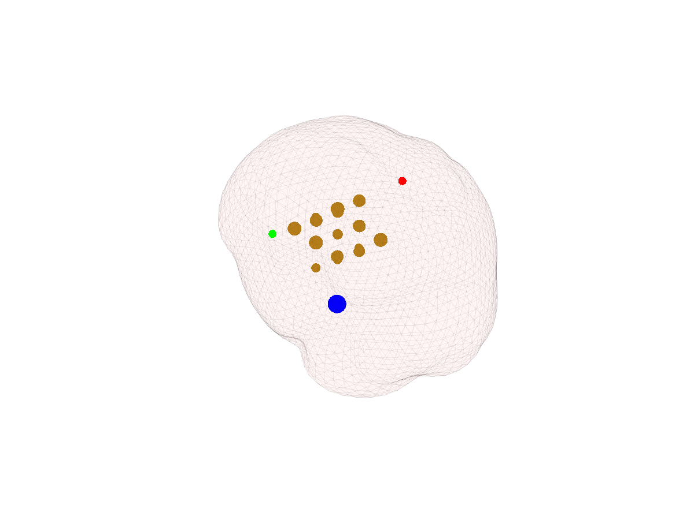
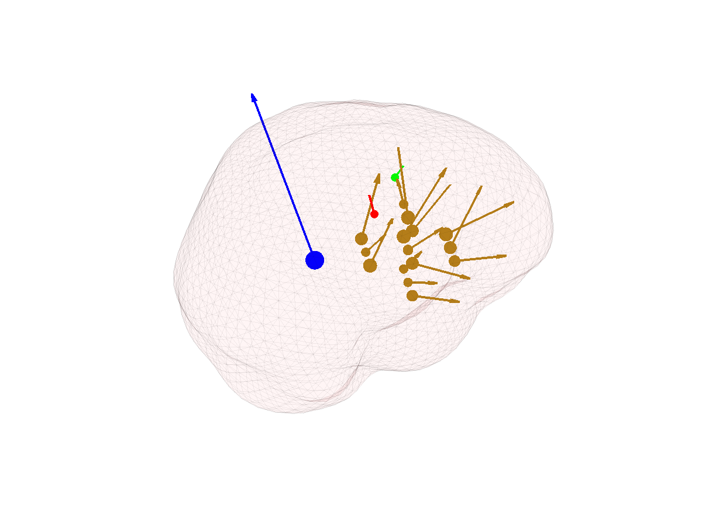

Part II: Simulating EEG sources
============

[[Parent]]: tutorial_dipoles.txt

By now our head model should be fully operational so we can start placing
artificial EEG sources within the brain volume. An _EEG source_ is just one 
or more source grid locations having a common temporal activation pattern. 
From a neurophysiological perspective, you can intuitively understand an EEG 
source as a compact cluster of neurons whose activity is well represented by
their average post-synaptic potentials. The time course of such average
post-synaptic potentials is what we call the _temporal activation_ of the 
EEG source.

## Simulated EEG sources


### Adding new EEG sources

Let's start with the command:

````matlab
myHead = add_source(myHead);
````
	
which will create a [dipole][wiki:dipole] of random location and orientation.
The characteristics of the dipole are stored in property `Source` of the
`myHead` object. In my case, the characteristics of the random dipole are:

	>> myHead.Source
	ans = 
	
	       name: []
	   strength: 23.1095
	orientation: [-0.6523 -0.5037 0.5664]
	      angle: 47.4691
	        pnt: 146
	   momentum: [-15.0739 -11.6402 13.0895]
	 activation: 1
	      depth: 35

[wiki:dipole]: http://en.wikipedia.org/wiki/Dipole

The information above tells us that our dipole is located at the coordinates
`myHead.SourceSpace.pnt(146,:)`. It also tells us the orientation of the 
dipole (a unit length vector) and its strength (the length of the dipole). 
The result of multiplying the strength with the orientation vector is what
is called the dipole _momentum_. The `activation` of the dipole is its time
course. In this tutorial we will deal only with fixed dipoles (without temporal
variation of their time course). 

The method `add_source` that we used to generate our random dipole has 
several optional arguments that you can use to specify the characteristics 
of the dipole that you wish to incorporate to your source model. For instance,
the following command:

````matlab
myHead = add_source(myHead, 'MinDepth', 1, 'MaxDepth', 30)
````
	
will generate a dipole that is at least 1 mm deep in the brain and at most
30 mm away from the closest point on the inner skull surface. Note that 
the new dipole was _added_ to our head model, i.e. the dipole that we 
generated previously is still in `myHead.Source`. You can check how many 
EEG sources your model has by inspecting property `NbSources`:

	>> myHead.NbSources
	ans =
	
		2

		
### Inspecting the properties of an EEG source

Each EEG source that you add to your head model is stored in property 
`Source` of your `head.mri` object. We can inspect the properties 
of the last EEG source that we just generated using the command:

````matlab
myHead.Source(2)
````

which will display:

	>> myHead.Source(2)
	
	ans = 

           name: []
       strength: 1
    orientation: [-0.9549 -0.1926 -0.2261]
          angle: 47.4691
            pnt: 1
       momentum: [-0.9549 -0.1926 -0.2261]
     activation: 1
	      depth: 12


		
		
### Removing EEG sources

To remove an EEG source use the command:

	myHead = remove_source(myHead, [1 2])

where the second argument is a vector with the indices of the sources that
should to be removed. The example above will remove the two sources that we 
have generated so far, leaving our head model empty of any EEG source.


### Make your own EEG sources

Display the help of `add_source` using `help head.mri.add_source` and read
 it carefully. Then try to generate dipoles with the following characteristics:

1. A radial dipole that is no more than 10 mm deep.
2. A tangential dipole no more than 10 mm away from the brain surface.
3. A randomly oriented dipole that is 3 times stronger than the two dipoles above and
that is located at least 40 mm deep inside the brain.
4. A compact EEG source that consists of 15 dipoles with random orientations and
 with strengths varying between 1 and 2.

__NOTE:__ After creating each source, inspect the corresponding element 
of the `Source` property of `myHead`, in order to ensure that 
the source has the desired properties.

## Plotting EEG sources

### Source location

Plot the location of __all four EEG sources__ that you generated above using the
 following method:

````matlab
close all; % Close all existing figures
figure;    % Create a new (empty) figure
plot_source_dipoles(myHead, [1 2 3 4]);
````
	
where the second input argument is a vector with indices of the EEG sources
that you want to plot. The result of this command should be something similar
to the first figure in the gallery below (of course the dipole locations will be
different in your case, as they are random). Rotate the figure and check that
the third source is indeed much deeper than the first two sources. 

### Source momentum

Our first attempt at plotting the EEG sources was successful but we would like
to see also the orientation and the strength of each source. To plot the 
strength:

````matlab
close all;
figure;
plot_source_dipoles(myHead, 1:4, 'time', 1, 'sizedata', 200);
````
	
The result is shown in the second figure below. You should get something similar, but 
with different dipole locations and strengths. The `'sizedata'` argument
can be used to increase the default size of the source location markers. So if the size
of the dipoles markers is to small or too large in your case, try to tune the `'sizedata'`
argument. In any case, the size of the dipole markers should be proportional to the dipole
strength. If we also want to plot the orientation of the dipoles we can use:

````matlab
figure;
plot_source_dipoles(myHead,[1 2 3 4],'time',1, 'sizedata',200,'momentum',10)
````

The `'momentum'` value is analogous to argument `'sizedata'` and can be used to manipulate
the length of a dipole of strength 1. So by modifying `'momentum'`, you will modify 
the length of the dipoles arrows. But notice that, as was the case with `'sizedata'`, 
argument  `'momentum'` is only for display purposes and has no effect on the properties of
the underlying dipoles. That is, the strength of the underlying dipoles is not affected 
by you playing with `'momentum'` or `'sizedata'`.

### Source leadfield

Each EEG source generates a characteristic distribution of scalp potentials. 
In the following I will loosely refer to such pattern as the _source leadfield_. 
The _source leadfield_ is the __normalized_ potential distribution that we would
see at the scalp if only the source of interest would be active and all other
sources would be silent. You can plot the _source leadfield_ with the command:

````
figure;
plot_source_leadfield(myHead,1)
````
	
Don't forget to use the rotate tool from the figure toolbox to visualize properly 
the topography of scalp potentials that is generated by the EEG source dipole.

A very important point is that the source leadfield is 
__completely independent of the temporal activation of the source__. This means
that, if only one source is active, the normalized distribution of scalp
potentials will be the same at any time, even if the underlying source has very
 complex temporal dynamics. This has also implications for localizing the source
afterwards because the only thing that we need to (attempt to) localize an EEG
source is its _source leadfield_.

You can also plot on the same figure the location and orientation of the source:

````matlab
close all;
figure;
plot_source_leadfield(myHead,1, 'momentum', 50)
````

or plot that information for all EEG sources simultaneously:

````matlab
close all;
figure;
plot_source_leadfield(myHead,1:4,'momentum',50)
````
	
Below you can find some of the figures that you may generate in this section 
of the tutorial. Hover over the images for a short description of what each 
image represents.





	

## Background noise

To be more realistic you can also simulate the presence of background (noisy) 
activity. It is difficult to define what is noisy neural activity. The 
easiest way is probably using an example. If you are interested in studying 
the generators of EEG activity in the alpha band then we would regard as noisy
any neural activity that is not related to EEG-alpha.

You can generate background noise with the command:

	myHead = add_source_noise(myHead, 'MaxStrength', 1);

which will create a _noisy_ EEG source and put it in `myHead.Source`. You can
identify the noisy source from the rest by the fact that the noisy source
has the name `'noise'`:

	myHead.Source(5)

	ans = 

	           name: 'noise'
	       strength: [325x1 double]
	    orientation: [325x3 double]
	          angle: [325x1 double]
	            pnt: [1x325 double]
	       momentum: [325x3 double]
	     activation: [325x1 double]

You can plot the characteristics of the noisy activity using:

	close all;
	figure;
	plot_source_leadfield(myHead,'noise','momentum',50)
	
You can also visualize the effect that the noisy activity has on the overall 
distribution of scalp potentials at the scalp:

	close all;
	figure;
	plot_source_leadfield(myHead, 1:5)
	
Please familiarize yourself with methods `plot_source_dipoles` and
`plot_source_leadfield`, and ask your tutor any questions you may have before going
 any further.
	
[[set_many Gallery]]:
	thumbnail_max_width 250
	thumbnail_max_height 250
	
[[Gallery]]:
	
	dipoles_leadfield_noise.png	
	- Distribution of scalp potentials generated by the background noise
	dipoles_leadfield_noise_all.png
	- The effect of noise on the overall distribution of scalp potentials
	

## What now?

Now you are ready to go to [Part III][part3] of this tutorial where we attempt
to localize some of the EEG sources that we just simulated.


[part3]: ./source_localization.htm
