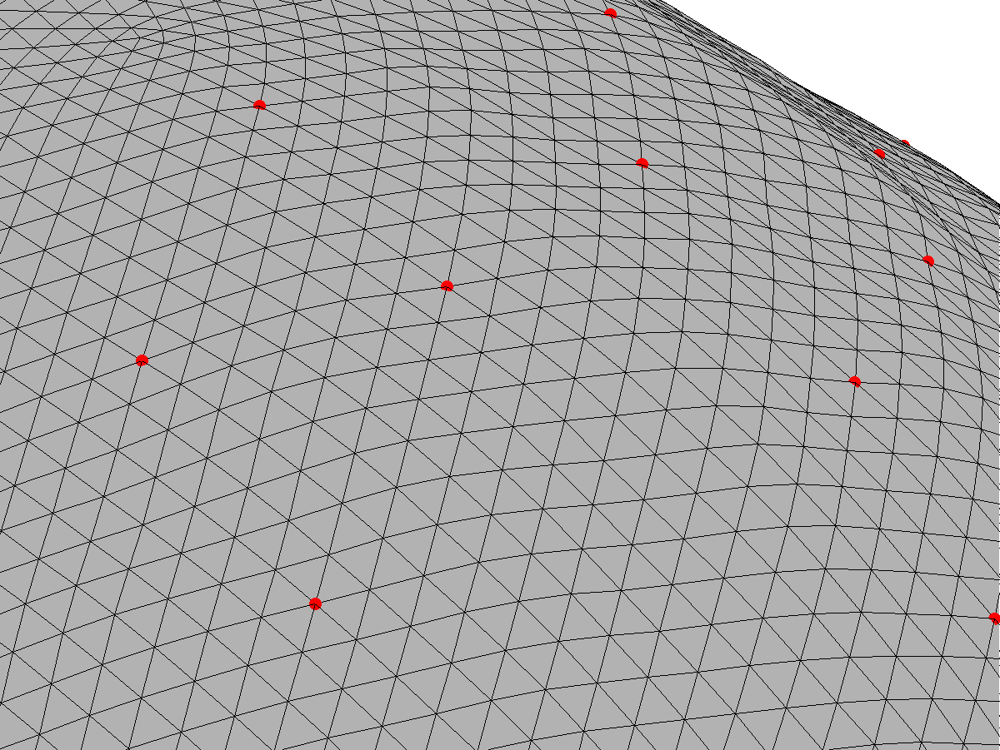
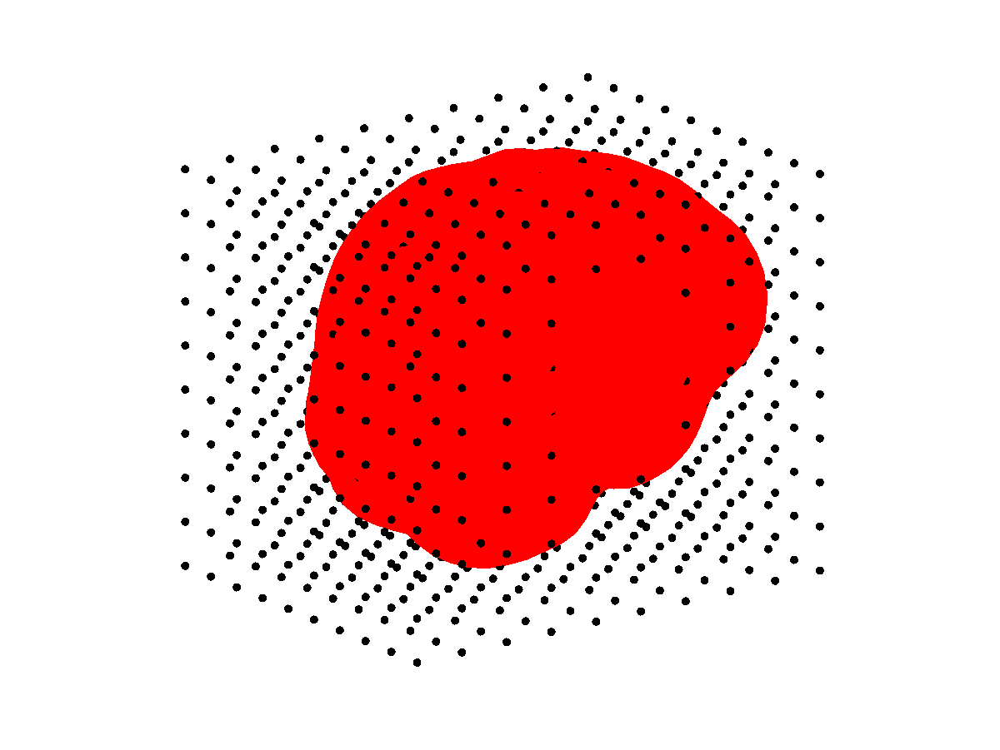

Part I: A realistic head model
============

[[Parent]]: tutorial_dipoles.txt

In this tutorial we  use a realistic electromagnetic model to map 
intracerebral current sources (modeled as dipoles) to a set of EEG sensors.
Our model is based on a real MRI scan from an unknown subject identified 
by the code `0003`. Below are the main steps that we need to take in order 
to build our head model. The first three steps have been already performed
 for you, but you will need to carry out the other four steps to 
successfully build a model that we can play around with. 

## Step 1: Tissue segmentation

Different brain tissues have different characteristic conductivities. A 
realistic head model needs to take this fact into account and, therefore, 
tissue types need to be segmented. Typically, only scalp, skull and 
cerebral tissues need to be identified in order to build a reasonably 
accurate electromagnetic model. However, you can complicate your model 
by segmenting also white and gray matter and, if you really like making 
your life difficult, by taking into consideration the fact that tissue
 conductivity (especially within white matter) is 
[anisotropic][wikipedia:anisotropy].

[wikipedia:anisotropy]: http://en.wikipedia.org/wiki/Anisotropy

In the old times, brain tissues had to be manually or semi-automatically 
segmented. This was not only time consuming but also highly subjective. 
Fortunately, the standardization of MRI scanning technology has
allowed the development of extremely accurate fully-automated tissue 
segmentation packages. There are multiple freely available alternatives but,
arguably, the most robust and widely tested software package is 
[Freesurfer][freesurfer], developed at the [Athinoula A. Martinos Center 
for Biomedical Imaging][athinoula].     

[freesurfer]: http://surfer.nmr.mgh.harvard.edu/
[athinoula]: http://www.nmr.mgh.harvard.edu/martinos/


## Step 2: Surface reconstruction

Once different tissues  have been identified, we need to build closed 
triangulated surfaces between all relevant tissue types. In our model we 
have three such surfaces: the _outer skin_ surface (on which the 
EEG sensors rest), the _outer skull_ surface, and the _inner skull_ surface
(within which the _EEG sources_ may be located). These surfaces can be 
automatically generated using a variety of software packages. In this 
tutorial we used the _watershed_ algorithm included in the [MNE software][mne], 
which is also maintained by the [Athinoula A. Martinos Center][athinoula]. 

[mne]: http://www.nmr.mgh.harvard.edu/martinos/userInfo/data/MNE_register/

The resulting surfaces are available in `.tri` data format in folder 
`db/0003`:

	0003-inner_skull-5120.tri
	0003-inner_skull-dense.tri
	...
	0003-outer_skin-5120.tri
	0003-outer_skin-dense.tri
    

There are two versions of each surface. The `dense` surfaces are just
more densely tessellated versions of the `5120` surfaces, which consist of
(only) 5120 vertices. 
    

## Step 3: Sensor co-localization

The purpose of having a densely tesselated outer skull surface is that 
it allows for more accurate co-registration of the EEG sensor locations. That 
is, it makes it easier to match each EEG sensor with a surface vertex.
For this tutorial we use a state-of-the-art sensor net with 256 sensors by
 [EGI][egi]. The standard sensor locations provided by EGI were co-registered
 with surface `0003-outer_skull-dense.tri` using [Fieldtrip][fieldtrip], and
 are available in file `0003-sensors.hpts`. The latter is just a text file that
 you can inspect with a text editor, if you want.

[egi]: http://www.egi.com
[fieldtrip]: http://fieldtrip.fcdonders.nl/

## Step 4: Loading and inspecting the anatomical model

You can load the surface information into MATLAB using the command:

````matlab
myHead = head.mri('SubjectPath', 'db/0003')
````
  
assuming of course that you are in the `tutorial_dipoles` folder that you
 created when you unzipped the tutorial files. The command above will
 create an _object_ of class `head.mri`. An object is just a convenient
 representation for a bunch of _data_ and operations (or _methods_) that
 can be performed on that data. You can read more about
  [objects with MATLAB][matlab-oop] if you want. 

[matlab-oop]: http://www.mathworks.nl/company/newsletters/articles/introduction-to-object-oriented-programming-in-matlab.html

[oop]: http://en.wikipedia.org/wiki/Object-oriented_programming


You can now easily plot the model surfaces with the command:

````matlab
figure; 
plot(myHead);
````

Just for fun, use the figure toolbox (at the top of the figure that just opened) to
rotate and zoom in/out the head model. Rotating might be slow if your computer is not
very powerful. Now, see `help head.mri.plot` and try to make a figure that displays
only the inner skull surface and the locations of the sensors. Then, save this figure
using MATLAB's built-in command `print`:

````matlab
print -dpng myfigure.png
````
  
which will save the current figure in [portable network graphics][png] format in a
file called `myfigure.png`.  

[png]: http://es.wikipedia.org/wiki/Portable_Network_Graphics
	
If you zoom in the head model that we generated above, you will see that the EEG
sensors (displayed as red dots) do not fall exactly on vertices of the outer
skin surface. Try it and you should see something like the figure on the right below. 


However, recall that we said that EEG sensors need to be co-registered
with vertices of the outer skin surface. The reason for the discrepancy is that we performed the co-registration using the `dense` version of the outer 
skin surface but our head model is actually based on a lower-resolution 
triangulated surface (the `0003-outer_skull-5120.tri` surface). Indeed, you 
can see that the sensors do fall on vertices of the `dense` surface:

````matlab
figure;
h = plot(myHead, 'Surface', 'OuterSkinDense');
set(h(1),'facealpha',1,'edgealpha',1);
````

The `'facealpha'` and `'edgealpha'` are just properties of the surface plot 
that we can use to manipulate the transparency of the triangles (the _faces_) and of the edges.





You can force the sensors to really fall on vertices of the low resolution
outer skin surface with the command:

````matlab
close all; % Just to close previous figures
myHead = sensors_to_outer_skin(myHead)
````
	
Zoom-in the generated figure to ensure that the sensors are now placed on vertices of the
coarse head surface.


### Step 5: Intracerebral source grid

In order to build an electromagnetic model we need to specify the 
spatial locations where EEG sources may be located. This is typically done by
uniformly sampling the inner skull volume using a regular 3D grid:

````matlab
myHead = make_source_grid(myHead, 0.5)
````
	
where the second input argument is a scalar in the range [0 1] that determines
the density of the generated grid. The higher the density, the higher the number
of elements in the source grid. Play a bit with the density value to see how
 it works. However, this tutorial has been tested only with a grid 
 density of 0.5. Using a higher or lower value might have unexpected results, 
 like abnormally inaccurate inverse solutions, and is not recommended. 




What do you think are the benefits of having a denser source grid? And the
disadvantages?
	

## Step 6: BEM computation

The steps above have fully described the anatomical aspects of our head model.
It is now time to compute the electromagnetic model. That is, to describe the
mapping that relates activity at the source grid locations to activity at the
scalp sensor locations. This mapping can be computed using a 
[Boundary Element Method (BEM)][wikipedia:bem].

[wikipedia:bem]: http://en.wikipedia.org/wiki/Boundary_element_method

Again, there are multiple freely available software packages implementing the
BEM. [EEGLAB][eeglab], [Fieldtrip][fieldtrip], and the 
[MNE software][mne] are just three examples. Moreover, each of these software
packages include several algorithms for computing the BEM coefficients. In this
tutorial we use the default algorithm [(Oostendorp and Oosterom, 1989)][becmp] of the Fieltrip toolbox. To compute the BEM model, just run the command:

````matlab
myHead = make_bem(myHead);
````

[eeglab]: http://sccn.ucsd.edu/eeglab/
[becmp]: http://dx.doi.org/10.1109/10.19859 

The step above might take few minutes to compute.
As you may have guessed already, the computation of the BEM model will take
longer, the denser the triangulated boundaries of the head model. This is precisely
the reason why we did not use the `dense` surfaces to build our model, but decided to use those only for sensor co-registration purposes. An even more
important problem of using too dense surfaces is that it can lead to numerical
innaccuracies due to the fact that the model may become [ill-conditioned][illconditioned].

[illconditioned]: http://en.wikipedia.org/wiki/Condition_number


## Step 7: Leadfield generation

The actual mapping from source grid locations to EEG sensors (also known as
the _leadfield matrix_) is computed, based on the BEM model, with the
following command:

````matlab
myHead = make_leadfield(myHead);
````

This step may also take a couple of minutes to compute. It will take longer
the higher the number of sensors and the higher the number of source grid
locations. 

The result of this step is a 257x3xN matrix, where N is the number of 
source grid locations. This matrix is stored in the `LeadField` property
of our `myHead` object:

````matlab
myHead.LeadField	% The leadfield matrix
````

The meaning of the leadfield matrix is straightforward. If you had a 
dipole ''m=[m_x, m_y, m_z]'' at the ''i''th grid location (whose coordinates
are in `myHead.SourceSpace.pnt(i,:)`), then the EEG measured at the ''j''th
sensor would be:

````matlab
% EEG potential measured at the 10th sensor assuming a single
% dipole at the 100th source location:
i = 100;
j = 10;
% The dipole coordinates:
m = [0;1;0]
leadField_ji = myHead.LeadField(j, :, i)
v = leadField_ji*m
`````

There is an important point that you should realize here. The scalp
potentials generated by a source dipole do not depend only 
on the strength of the source (the length of the dipole) but they do 
also __strongly depend on its orientation__. As you will see below, dipoles
that are close to the scalp and are tangentially or radially oriented 
with respect to the scalp surface generate very 
characteristic distributions of potentials across the scalp.

__NOTE:__ Computing the leadfield matrix requires solving 
[Maxwell equations][maxwell], 
under the boundary conditions imposed by the head model. These are 
complicated differential equations and some of you may wonder how can 
their solution be as simple as a linear and instantaneous mapping. 
The answer is that the exact solution to Maxwell equations is far from 
being that simple. However, in EEG and MEG applications we take advantage of the
fact that the signals measured rarely exceed frequencies above 1 KHz. 
At such low frequencies, we can safely use the so-called quasi-static
approximation of Maxwell equations, which indeed leads to a solution
that is just a linear and instantaneous mapping. For those interested in 
bioelectromagnetism I recommend the book by 
[(Malmivuo and Plonsey, 1995)][malmivuo].

[malmivuo]: http://www.bem.fi/book/

[maxwell]: http://en.wikipedia.org/wiki/Maxwell%27s_equations


## What now?

Now you are ready to go to [Part II][part2] of this tutorial where we will use
the head model that we just prepared to simulate EEG sources and to study
the patterns of scalp potentials that such sources generate.


[part2]: ./eeg_sources.md